# Roost Hackathon Sample Submission Guide
Alice and Bob form a team to participate in Roost Hackathon. 
Alice brings web development experience and Bob is expert at writing API.

## 5 Steps for Alice and Bob to collaborate effectively in Roost Hackathon
 - Sign up at Roost Hackathon and Roost.io
 - Download and install Roost Desktop
 - Add each other to Roost Network
 - Develop and test microservice using Roost Desktop
 - Share Kubernetes Manifest using Roost Collaborate and enjoy an integrated application
 
 <b>_Finally, SUBMIT PROJECT to [HackerEarth: Roost Hackathon](https://roost.hackerearth.com) for your chance to WIN._</b>

## Step 1: Sign-up for the Hackathon and Sign-in at Roost.io 
- Each Team Member Registers for the Roost Hackathon. [HackerEarth Registration](https://roost.hackerearth.com/)
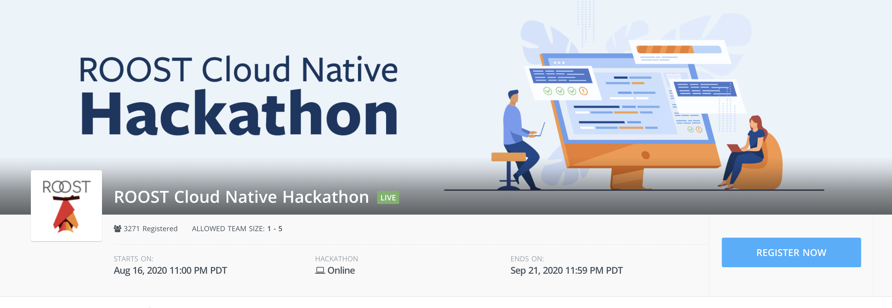

- Each Team Member Signs-in to [roost.io](https://roost.io) and chooses a handle OR username. In this guide, the Team Members are 'alice' & 'bob' for their respective roost handles.
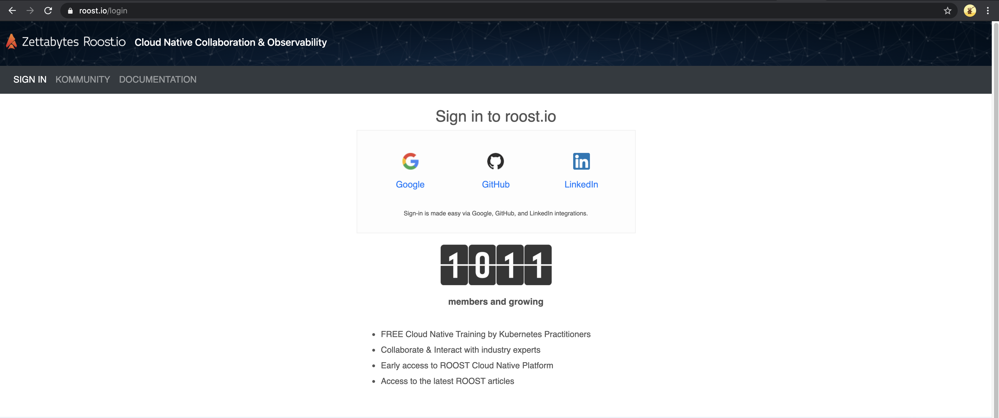

## Step 2: Download and install Roost Desktop
- Each Team Member Downloads and installs [Roost Desktop](http://roost.io/download) in their respective development machines.

## Step 3: Alice and Bob connect via Roost
- Alice creates a request for <b>Push Access</b>.

- Alice searches for Bob's roost handle 'bob' and requests <b>Push Access</b>. (Bob's email address he used to register at Roost.io can also be searched)
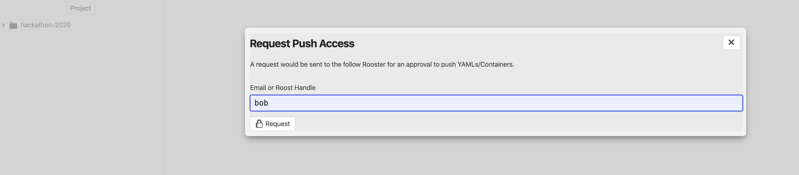

- Bob <b>Approves</b> Alice's <b>Push Request</b> from his Roost Desktop.
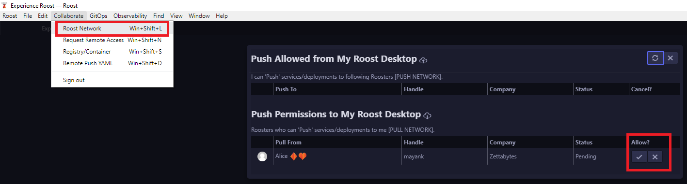

- Likewise, Bob will request <b>Push Access</b> to Alice.  Accordingly, Alice will <b>Approve</b> Bob's corresponding <b>Push Request</b>. (Bob searched 'alice' to make the Push Request)

## Step 4: Develop and unit-test your microservice using Roost Desktop
- Alice uses Roost Desktop to develop front-end microservices in Alice's programming language of choice.  This implies a Docker image and Kubernetes Manifest.

- Alice builds a [docker image: voter/Dockerfile](voter/Dockerfile) for the front-end service. 
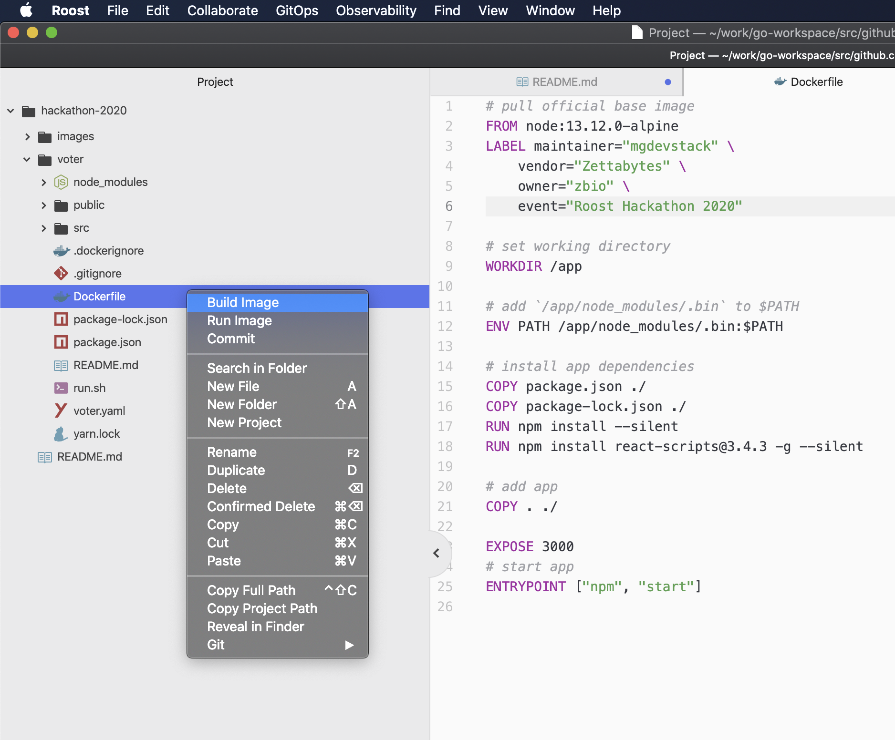

- Alice creates a [Kubernetes Manifest: voter/voter.yaml](voter/voter.yaml) to deploy her frontend microservice in ZKE Cluster and completes unit testing.

- Likewise, Bob also uses Roost Desktop to develop back-end microservices in Bob's programming language of choice.  This too implies a Docker image and Kubernetes Manifest.

- Bob builds a [docker image: ballot/Dockerfile](ballot/Dockerfile) for the back-end service.

- Bob creates a [Kubernetes Manifest: ballot/ballot.yaml](ballot/ballot.yaml) to deploy back-end service in ZKE Cluster and completes unit testing.
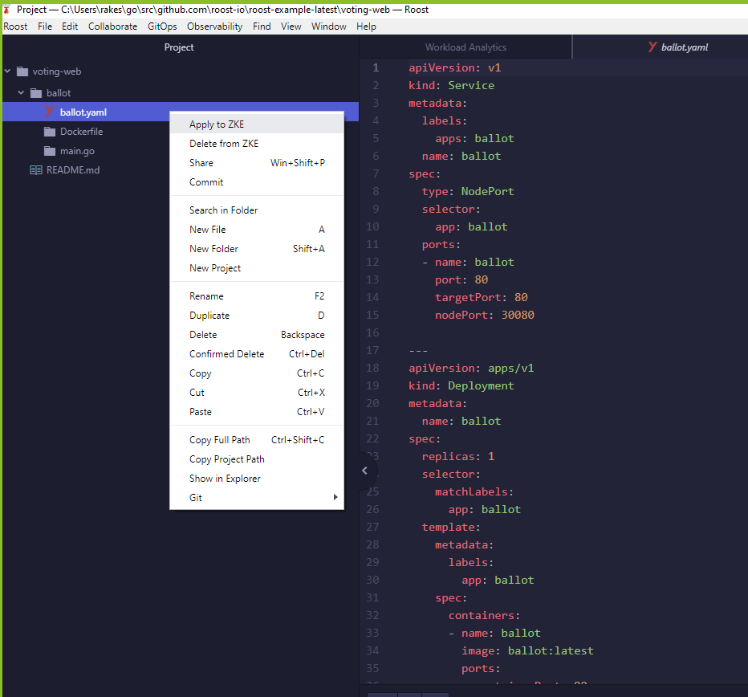

## Step 5: Collaborate & Integrate!
- Alice shares the front-end microservice with Bob.

- Alice right-clicks on voter.yaml and selects "Share" and sends it to Bob.
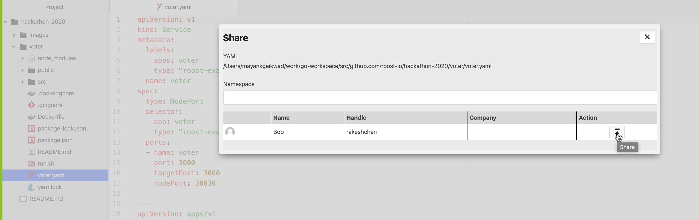

- Alice can see collaboration ZKE events within Roost Desktop.
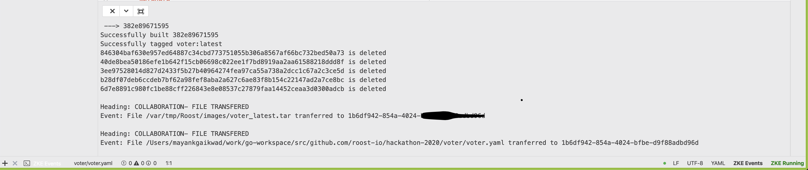

- Bob also gets COLLABORATION ZKE Events once the deployment shared by Alice is received on his machine.

- Bob can see the deployed front-end service in his workload analytics.
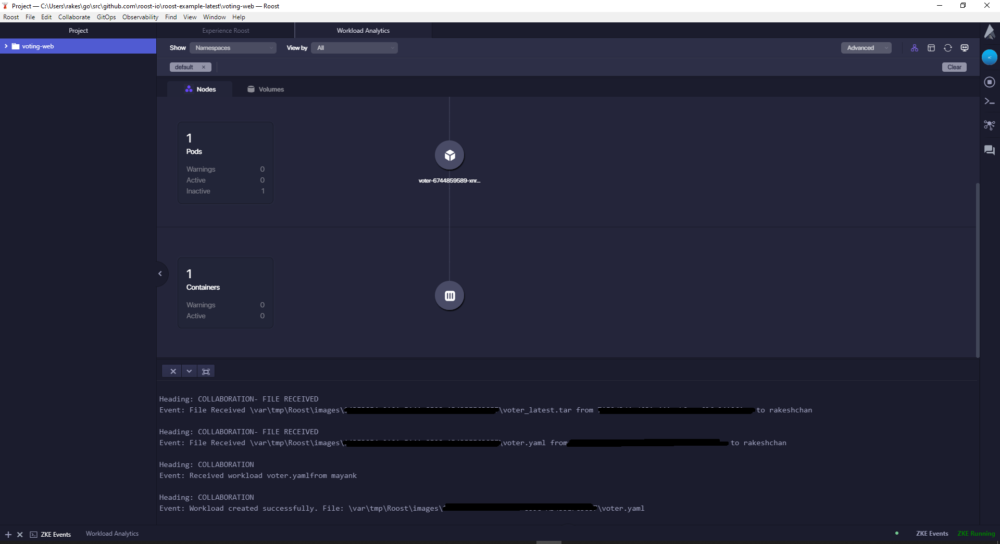

- Bob already has his back-end service running in Roost Desktop. Bob can now see 2 microservices running.
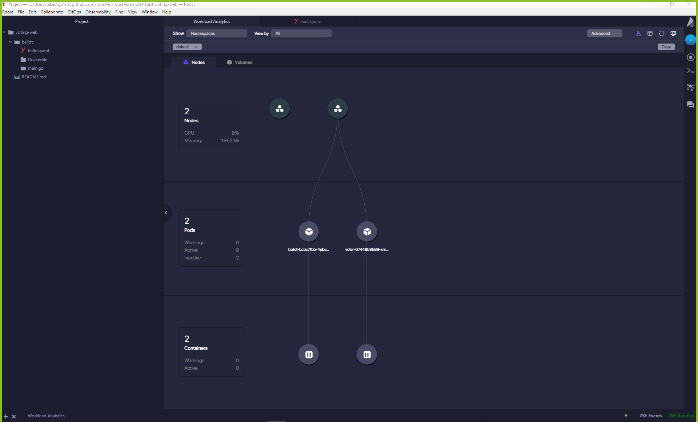

- Bob verifies the integration by opening the Application URL.
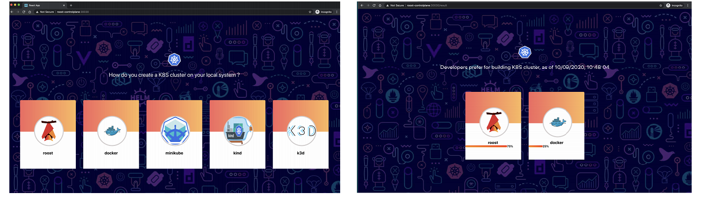

## READY for Hackathon Submission

- Alice and Bob push their code to a public <b>GitHub</b> or <b>GitLab</b> repository.

- They create a PPT or PDF highlighting their Microservices, Inter-dependency and Collaboration end-result. [Sample_Presentation.pdf](RoostHackathon_Presentation.pdf)

- Optionally they create a recording of their service creation and collaboration. (https://www.youtube.com/watch?v=flRl9b7W_Gc)

- Sign in to https://roost.hackerearth.com and click on SUBMIT PROJECT.  Share 1 or more: PDF / PPT / Recording AND share the repository URL (GitHub/GitLab)
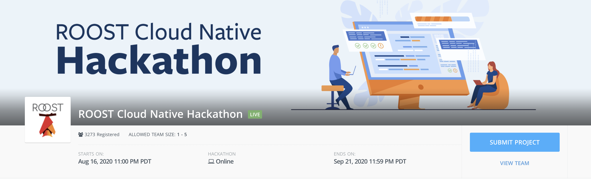

## If you have any questions, Cloud Native Experts are available to #support you via [Slack](https://bit.ly/joinRoost)
